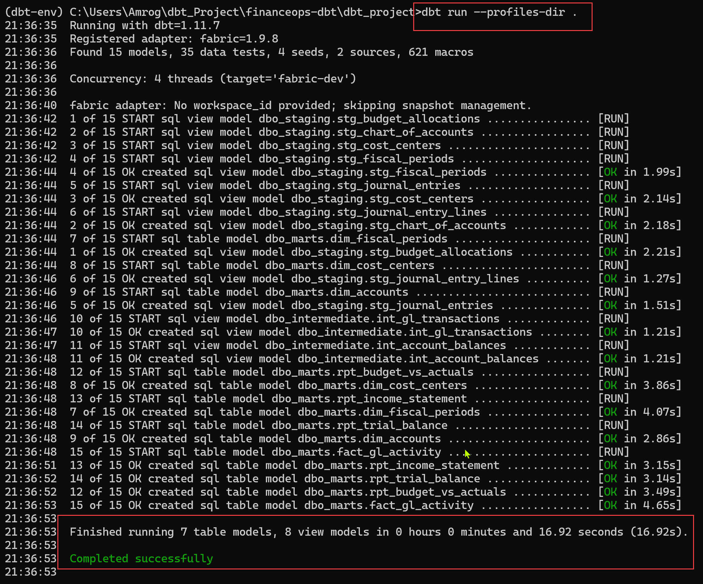
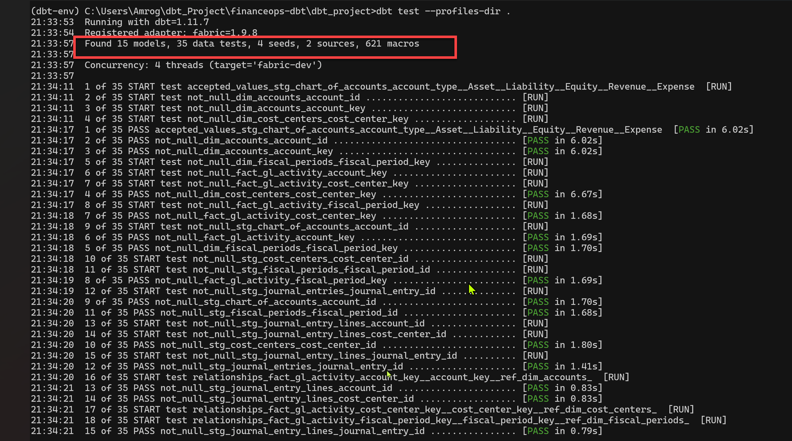
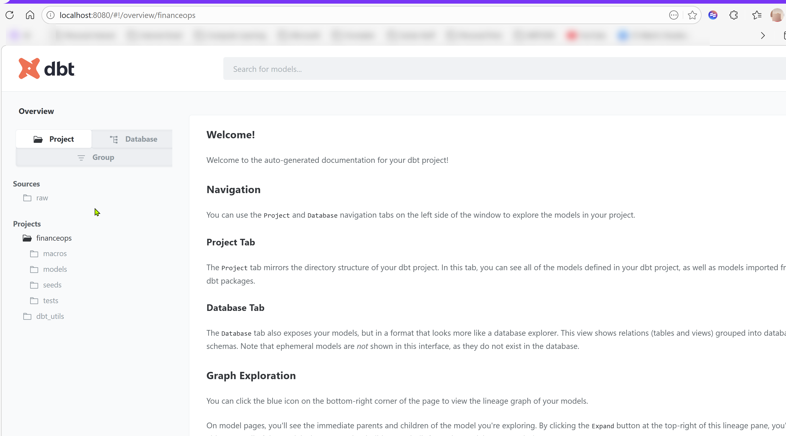
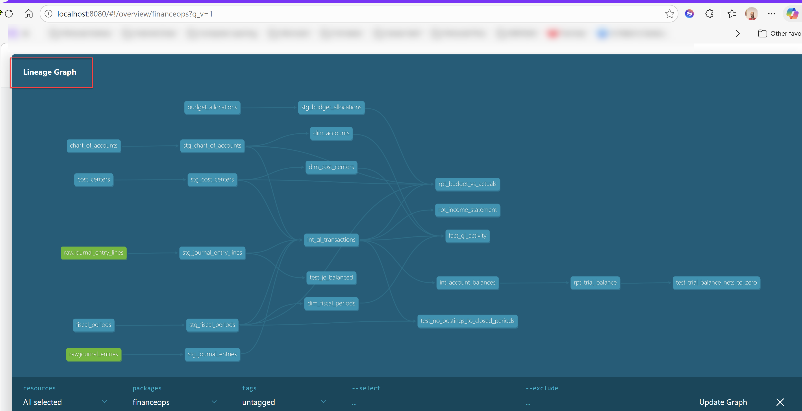
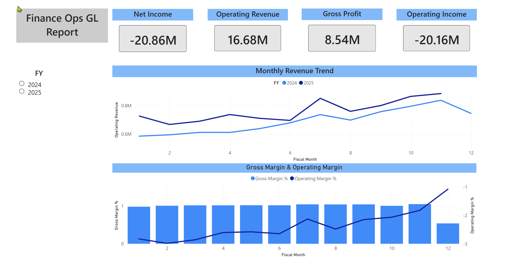
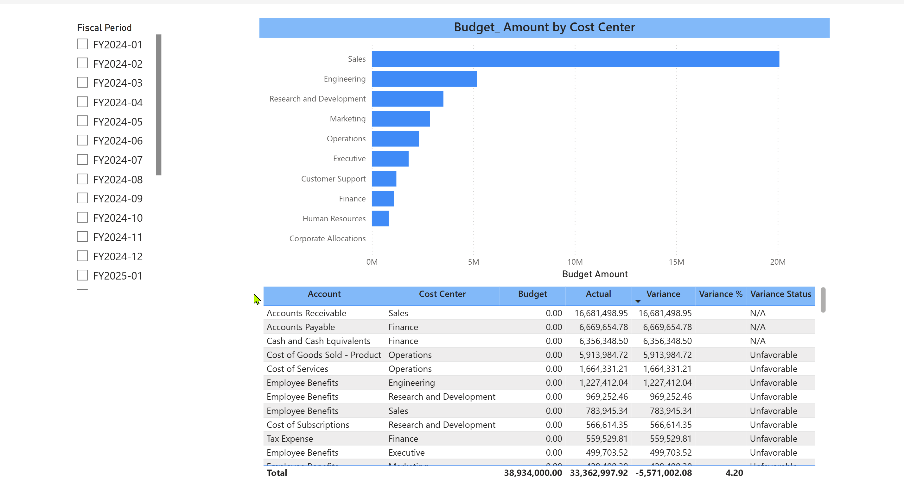
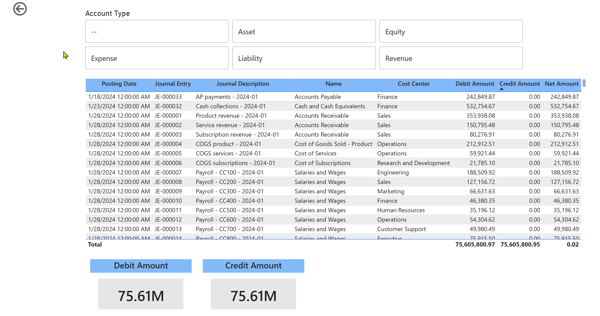

# Project 5: FinanceOps — Data Warehouse + dbt

**Workspace:** `FinanceOps_Warehouse`
**Status:** Complete
**Fabric Workloads:** Data Warehouse, Data Factory, dbt Core (dbt-fabric adapter), Power BI

---

## What This Project Does

Builds a complete general ledger analytics system on a Fabric Data Warehouse using dbt Core for SQL-first transformations. Raw journal entry data flows through a Copy Activity pipeline into the warehouse, then dbt transforms it through staging → intermediate → mart layers into a star schema that powers a trial balance, income statement, budget variance analysis, and a 3-page Power BI report.

This is the only project in the portfolio where the transformation code — 15 dbt SQL models, 35 data quality tests, and a custom macro — lives in the repo as runnable, version-controlled code. A reviewer can clone this folder, point `profiles.yml` at a Fabric Warehouse, and execute the entire pipeline with `dbt seed && dbt run && dbt test`.

---

## Architecture

```
┌─────────────────────────────────────────────────────────────────────┐
│                     FinanceOps_Warehouse Workspace                  │
│                                                                     │
│  ┌──────────────────┐    Copy Activity    ┌──────────────────────┐  │
│  │FinanceOps_       │ ──────────────────► │FinanceOps_DW         │  │
│  │Staging_LH        │    PL_Load_GL_Data  │                      │  │
│  │                  │                     │  raw.journal_entries  │  │
│  │ Files/           │                     │  raw.journal_entry_   │  │
│  │  journal_        │                     │       lines           │  │
│  │   entries.csv    │                     │                      │  │
│  │  journal_entry_  │                     │  ┌─── dbt seed ───┐  │  │
│  │   lines.csv      │                     │  │ chart_of_accts │  │  │
│  └──────────────────┘                     │  │ cost_centers   │  │  │
│                                           │  │ fiscal_periods │  │  │
│                                           │  │ budget_allocs  │  │  │
│                                           │  └────────────────┘  │  │
│                                           │                      │  │
│                              dbt run      │                      │  │
│                          ┌────────────────┤                      │  │
│                          │                │                      │  │
│                          ▼                │                      │  │
│              ┌───────────────────┐        │                      │  │
│              │  Staging (views)  │        │                      │  │
│              │  stg_journal_     │        │                      │  │
│              │   entries         │        │                      │  │
│              │  stg_journal_     │        │                      │  │
│              │   entry_lines     │        │                      │  │
│              │  stg_chart_of_    │        │                      │  │
│              │   accounts  ...   │        │                      │  │
│              └────────┬──────────┘        │                      │  │
│                       │                   │                      │  │
│                       ▼                   │                      │  │
│              ┌───────────────────┐        │                      │  │
│              │ Intermediate      │        │                      │  │
│              │  int_gl_          │        │                      │  │
│              │   transactions    │        │                      │  │
│              │  int_account_     │        │                      │  │
│              │   balances        │        │                      │  │
│              └────────┬──────────┘        │                      │  │
│                       │                   │                      │  │
│                       ▼                   │                      │  │
│              ┌───────────────────┐        │                      │  │
│              │  Marts (tables)   │        │                      │  │
│              │  dim_accounts     │        │                      │  │
│              │  dim_cost_centers │        │                      │  │
│              │  dim_fiscal_      │        │                      │  │
│              │   periods         │        │                      │  │
│              │  fact_gl_activity │        │                      │  │
│              │  rpt_trial_       │        │                      │  │
│              │   balance         │        │                      │  │
│              │  rpt_income_      │        │                      │  │
│              │   statement       │        │                      │  │
│              │  rpt_budget_vs_   │        │                      │  │
│              │   actuals         │        │                      │  │
│              └────────┬──────────┘        │                      │  │
│                       │                   └──────────────────────┘  │
│                       ▼                                             │
│              ┌───────────────────┐    ┌──────────────────────────┐  │
│              │ Semantic Model    │───►│ Power BI Report (3 pages)│  │
│              │ FinanceOps_       │    │  Executive Summary       │  │
│              │  SemanticModel    │    │  Budget vs Actuals       │  │
│              │                   │    │  GL Drill-Through        │  │
│              └───────────────────┘    └──────────────────────────┘  │
└─────────────────────────────────────────────────────────────────────┘
```

---

## Dataset

All data was synthetically generated using a custom Python script (`datasets/generate_datasets.py`) to produce realistic financial patterns.

| File | Rows | Role | Load Method |
|------|------|------|-------------|
| `journal_entries.csv` | 798 | Transaction headers (FY2024–FY2025) | Copy Activity → raw schema |
| `journal_entry_lines.csv` | 1,596 | Transaction line items (debits/credits) | Copy Activity → raw schema |
| `chart_of_accounts.csv` | 39 | GL account definitions (5 types) | dbt seed |
| `cost_centers.csv` | 10 | Department reference data | dbt seed |
| `fiscal_periods.csv` | 24 | 24-month fiscal calendar | dbt seed |
| `budget_allocations.csv` | 360 | Budget targets by account/dept/period | dbt seed |

The data includes ~12% year-over-year revenue growth, Q4 seasonality, and three intentional data quality issues designed to validate the dbt test framework (see Data Quality section below).

---

## dbt Project Structure

```
dbt/
├── dbt_project.yml              # Project config: schema routing, materialization strategy
├── profiles.yml                 # Connection profile (Fabric warehouse, CLI auth)
├── packages.yml                 # dbt_utils for surrogate key generation
├── macros/
│   └── fiscal_quarter.sql       # Reusable quarter derivation macro
├── models/
│   ├── staging/                 # 6 views — clean, cast, standardize
│   │   ├── stg_journal_entries.sql
│   │   ├── stg_journal_entry_lines.sql
│   │   ├── stg_chart_of_accounts.sql
│   │   ├── stg_cost_centers.sql
│   │   ├── stg_fiscal_periods.sql
│   │   ├── stg_budget_allocations.sql
│   │   ├── _sources.yml         # Raw source definitions
│   │   └── _staging.yml         # Schema tests (unique, not_null, relationships, accepted_values)
│   ├── intermediate/            # 2 views — enrich and aggregate
│   │   ├── int_gl_transactions.sql      # Central fact grain: 1 row per JE line, enriched
│   │   └── int_account_balances.sql     # Running balances (BS) / period totals (IS)
│   └── marts/                   # 7 tables — star schema + reports
│       ├── dim_accounts.sql             # MD5 surrogate keys via dbt_utils
│       ├── dim_cost_centers.sql
│       ├── dim_fiscal_periods.sql
│       ├── fact_gl_activity.sql         # Star schema fact table
│       ├── rpt_trial_balance.sql        # Debits = Credits validation per period
│       ├── rpt_income_statement.sql     # Monthly P&L with margins
│       ├── rpt_budget_vs_actuals.sql    # Variance analysis (favorable/unfavorable)
│       └── _marts.yml                   # Mart-level schema tests
├── seeds/                       # 4 reference CSVs (version-controlled in repo)
│   ├── chart_of_accounts.csv
│   ├── cost_centers.csv
│   ├── fiscal_periods.csv
│   └── budget_allocations.csv
└── tests/                       # 3 custom data quality tests
    ├── test_je_balanced.sql             # Every JE must balance (debits = credits)
    ├── test_trial_balance_nets_to_zero.sql  # Period-level balance validation
    └── test_no_postings_to_closed_periods.sql  # Structural integrity check
```

**Model count:** 15 (6 staging views, 2 intermediate views, 7 mart tables)
**Test count:** 35 (32 schema tests + 3 custom tests)
**All tests passing:** ✅

---

## dbt Execution Results

```
$ dbt seed --profiles-dir .
Completed successfully. PASS=4

$ dbt run --profiles-dir .
Completed successfully.
Done. PASS=15 WARN=0 ERROR=0 SKIP=0 TOTAL=15

$ dbt test --profiles-dir .
Completed successfully.
Done. PASS=35 WARN=0 ERROR=0 SKIP=0 TOTAL=35


```




# DBT DAG Environment



## dbt Lineage Graph


---

## Data Quality Tests

### Schema Tests (32 tests)
- **unique** and **not_null** on all primary keys across staging and mart models
- **relationships** validating foreign keys (JE lines → JE headers, JE lines → accounts, JE lines → cost centers, fact → dimensions)
- **accepted_values** on `account_type` (Asset, Liability, Equity, Revenue, Expense)

### Custom Tests (3 tests)
- **test_je_balanced.sql** — Validates every posted journal entry balances within a $0.05 tolerance. Returns any JE where `ABS(SUM(debits) - SUM(credits)) > 0.05`.
- **test_trial_balance_nets_to_zero.sql** — Validates that total debits equal total credits at the period level.
- **test_no_postings_to_closed_periods.sql** — Structural check ensuring no transactions post to closed fiscal periods.

### Intentional Data Quality Issues (planted in dataset)
1. **Unbalanced JE (2025-03-15):** Off by $0.02 — a rounding error. Passes the $0.05 tolerance threshold but would fail at $0.01. Demonstrates the test framework catches real issues.
2. **Reversed entry pair (2025-06-10 / 2025-06-12):** $25,000 vendor payment posted incorrectly, then reversed two days later. Both entries flow correctly — the reversal nets to zero. Status field distinguishes "Posted" from "Reversed."
3. **Potential duplicate (2025-08-28):** Two JEs with identical amounts ($52,340) and descriptions posted 5 minutes apart. Could be legitimate (two separate invoices) or a duplicate. Demonstrates awareness of common GL data quality patterns.

---

## Power BI Report (3 pages)

### Page 1: Executive Summary
Monthly revenue trend (FY2024 vs FY2025), gross margin and operating margin combo chart, KPI cards for revenue, net income, gross profit, and operating income. Year slicer for FY2024/FY2025 comparison.



### Page 2: Budget vs Actuals
Budget allocation by cost center (bar chart), variance detail table with account, cost center, budget, actual, variance amount, variance percentage, and favorable/unfavorable status. Period slicer for month-level filtering.



### Page 3: GL Drill-Through
Detail-level journal entry lookup with drill-through on account name. Shows posting date, JE ID, description, account, cost center, debit, credit, and net amount. Summary cards for total debits and credits. Account type and fiscal quarter slicers. The $0.02 net imbalance from the planted data quality issue is visible in the totals.


---

## Key Engineering Decisions

**Why Warehouse over Lakehouse:**
Financial reporting is SQL-native — complex joins, aggregations, and DML operations. Fabric Warehouse supports full T-SQL DML (INSERT, UPDATE, DELETE, MERGE) that the Lakehouse SQL analytics endpoint does not. Schema-on-write is appropriate for structured financial data where schema drift should be caught, not tolerated.

**Why dbt Core locally instead of Fabric's native dbt Job:**
The native dbt job in Fabric is still in public preview with limitations — no package support (no dbt_utils for surrogate keys), no build caching, 1MB output limit. dbt Core locally provides the full feature set: packages, comprehensive testing, documentation generation with lineage graphs, and fast local iteration. The trade-off is a local Python environment, which is the right call for a portfolio demonstrating dbt proficiency.

**Why hash-based surrogate keys:**
Fabric Data Warehouse does not support IDENTITY columns. `dbt_utils.generate_surrogate_key()` produces deterministic MD5 hashes from natural key columns — idempotent and gap-free across re-runs, which is actually a better pattern for ELT workloads.

**Why land raw data as VARCHAR:**
The Copy Activity reads CSVs as strings. Rather than forcing type conversion at ingestion (which caused DATE/DATETIME2 errors), raw tables accept VARCHAR and the staging models handle all type casting. This is the production best practice — raw should be a faithful copy of the source; transformation layers enforce types.

**Why seed data for reference tables, raw tables for transactional data:**
Reference data (chart of accounts, cost centers, fiscal periods, budgets) is small, changes infrequently, and benefits from version control. dbt seeds keep it in the repo. Transactional data (journal entries) flows through the Copy Activity pipeline because it's larger and comes from source systems — mirroring the real-world pattern.

**Why general ledger as the scenario:**
The GL is the backbone of every finance department. It produces universally recognized outputs (trial balance, income statement, budget variance), requires multi-dimensional modeling (accounts × cost centers × periods), and provides rich data quality testing opportunities (debits must equal credits, no posting to closed periods). It's the highest-signal financial scenario for a portfolio.

---

## Workspace Items

| Item | Type | Purpose |
|------|------|---------|
| `FinanceOps_DW` | Data Warehouse | Full T-SQL warehouse with raw, staging, intermediate, and marts schemas |
| `FinanceOps_Staging_LH` | Lakehouse | File landing zone for CSV uploads (used by Copy Activity) |
| `PL_Load_GL_Data` | Data Pipeline | Copy Activity pipeline: Lakehouse CSVs → Warehouse raw tables |
| `FinanceOps_Notebook` | Notebook | Ad-hoc exploration and initial data loading attempts |
| `FinanceOps_SemanticModel` | Semantic Model | Star schema relationships (fact → 3 dimensions) |
| `FinanceOps_GL_Report` | Power BI Report | 3-page report: Executive Summary, Budget vs Actuals, GL Drill-Through |

---

## How to Run

**Prerequisites:** Python 3.8+, ODBC Driver 18 for SQL Server, Azure CLI, a Fabric Data Warehouse.

```bash
# 1. Create virtual environment
python -m venv dbt-env
source dbt-env/bin/activate        # Linux/Mac
dbt-env\Scripts\activate            # Windows

# 2. Install dbt
pip install dbt-core dbt-fabric

# 3. Authenticate
az login

# 4. Update profiles.yml with your warehouse SQL endpoint
# server: your-endpoint.datawarehouse.fabric.microsoft.com

# 5. Navigate to project and install packages
cd dbt
dbt deps --profiles-dir .

# 6. Load reference data
dbt seed --profiles-dir .

# 7. Build all models
dbt run --profiles-dir .

# 8. Run all tests
dbt test --profiles-dir .

# 9. Generate documentation with lineage graph
dbt docs generate --profiles-dir .
dbt docs serve --profiles-dir .
```

**Note:** Journal entries and journal entry lines must be loaded into `raw.journal_entries` and `raw.journal_entry_lines` before running dbt. Use the Copy Activity pipeline (`PL_Load_GL_Data`) or load manually via the Fabric SQL editor.

---

## Folder Structure

```
project-5-financeops/
├── README.md                    ← You are here
├── datasets/
│   ├── generate_datasets.py     # Python generator script
│   ├── journal_entries.csv
│   ├── journal_entry_lines.csv
│   ├── chart_of_accounts.csv
│   ├── cost_centers.csv
│   ├── fiscal_periods.csv
│   └── budget_allocations.csv
├── dbt/                         # Complete dbt project (runnable)
│   ├── dbt_project.yml
│   ├── profiles.yml
│   ├── packages.yml
│   ├── macros/
│   ├── models/
│   ├── seeds/
│   └── tests/
├── screenshots/
│   ├── warehouse_schemas.png
│   ├── dbt_run_output.png
│   ├── dbt_test_output.png
│   ├── dbt_lineage_graph.png
│   ├── trial_balance_query.png
│   ├── income_statement_query.png
│   ├── pbi_executive_summary.png
│   ├── pbi_budget_vs_actuals.png
│   └── pbi_gl_drillthrough.png
└── fabric-artifacts/            # Git-synced from FinanceOps_Warehouse workspace
```

---

*This is Project 5 in the [Microsoft Fabric Data Engineering Portfolio](../README.md).*
*Project 4: [SmartFactory — Real-Time IoT Monitoring](../project-4-smartfactory/README.md)*
*Project 6: CrossPlatform — Mirroring + Shortcuts (Coming Soon)*
